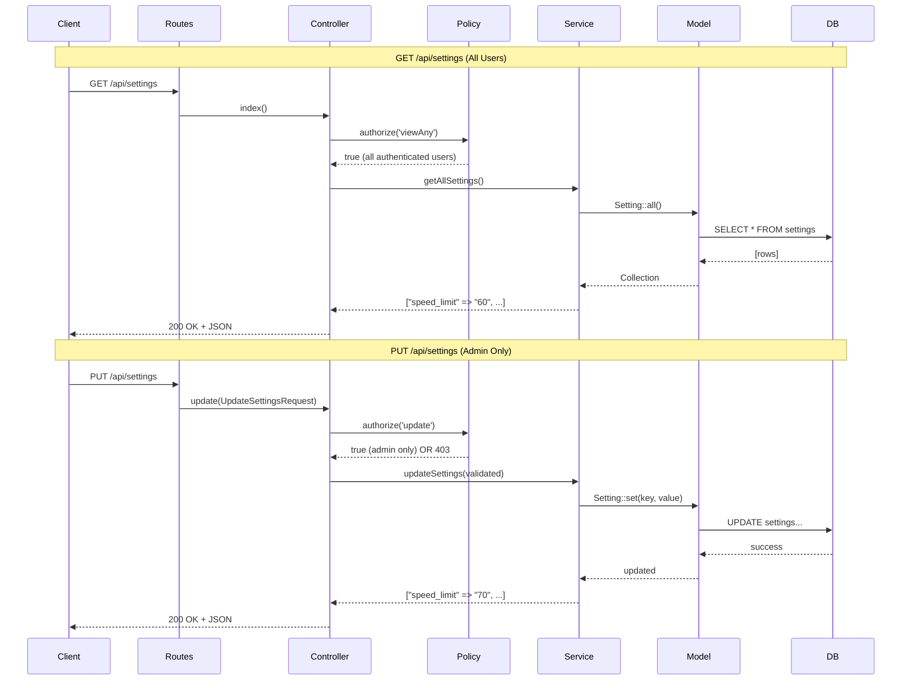
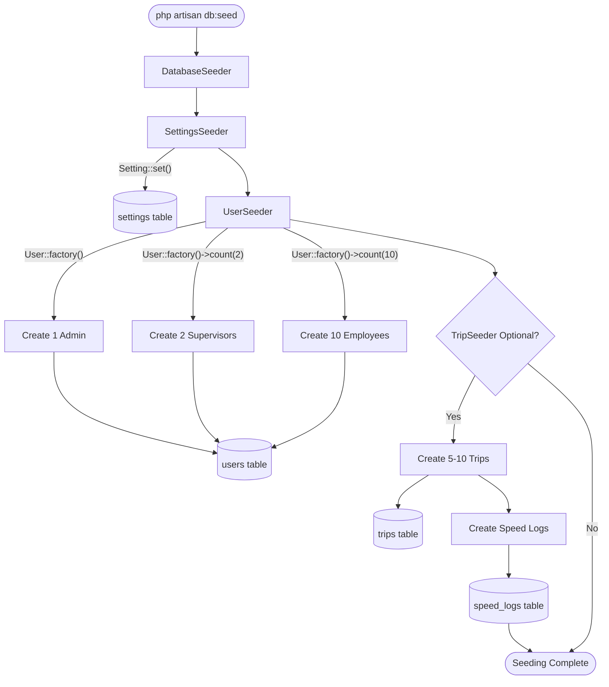

# Settings API & Database Seeders Implementation

## Overview

This plan implements:
- **US-2.5**: Settings API with GET/PUT endpoints, SettingsService, SettingPolicy, and admin-only access control
- **US-2.6**: Dedicated database seeders (UserSeeder, SettingsSeeder, TripSeeder) to replace inline seeding logic

## Current State Analysis

### Existing Infrastructure
- **Setting Model**: [`app/Models/Setting.php`](app/Models/Setting.php) already exists with static helpers `get()`, `set()`, `getSpeedLimit()`
- **Settings Migration**: [`database/migrations/2026_03_30_161704_create_settings_table.php`](database/migrations/2026_03_30_161704_create_settings_table.php) creates `settings` table with `key`, `value`, `description`
- **Current Seeding**: [`database/seeders/DatabaseSeeder.php`](database/seeders/DatabaseSeeder.php) seeds 3 users + 3 settings inline (not in dedicated seeders)
- **No Settings API**: No routes, controller, service, or policy exist yet

### Architecture Pattern
Based on existing [`app/Http/Controllers/TripController.php`](app/Http/Controllers/TripController.php):
- Controllers use **constructor dependency injection** for services
- **FormRequests** handle validation
- **Policies** handle authorization via `$this->authorize()`
- Services contain business logic
- Controllers return `JsonResponse` with proper status codes

## US-2.5: Settings API Implementation

### 1. Create SettingsService

**File**: [`app/Services/SettingsService.php`](app/Services/SettingsService.php)

**Responsibilities**:
- Fetch all settings with key-value pairs
- Bulk update settings with validation
- Use existing `Setting::get()` and `Setting::set()` static methods
- Return settings as associative array for API responses

**Key Methods**:
```php
public function getAllSettings(): array
{
    // Return all settings as ['key' => 'value'] array
    // Use Setting::all() + transform to array
}

public function updateSettings(array $settings): array
{
    // Validate each key exists (speed_limit, auto_stop_duration, speed_log_interval)
    // Update using Setting::set($key, $value)
    // Return updated settings array
}
```

### 2. Create SettingPolicy

**File**: [`app/Policies/SettingPolicy.php`](app/Policies/SettingPolicy.php)

**Authorization Rules**:
- `viewAny()`: All authenticated users can view settings (employees need to know speed limit)
- `update()`: Only admins can update settings

**Pattern**: Follow [`app/Policies/TripPolicy.php`](app/Policies/TripPolicy.php) structure

### 3. Create Form Requests

**Files**:
- [`app/Http/Requests/Setting/UpdateSettingsRequest.php`](app/Http/Requests/Setting/UpdateSettingsRequest.php)

**Validation Rules**:
```php
'speed_limit' => 'nullable|numeric|min:1|max:200',
'auto_stop_duration' => 'nullable|integer|min:60|max:7200',  // 1 min to 2 hours
'speed_log_interval' => 'nullable|integer|min:1|max:60',
```

**Authorization**: Check policy in `authorize()` method

### 4. Create SettingsController

**File**: [`app/Http/Controllers/SettingsController.php`](app/Http/Controllers/SettingsController.php)

**Endpoints**:

**GET /api/settings** (index method):
- Authorize with `$this->authorize('viewAny', Setting::class)`
- Call `$settingsService->getAllSettings()`
- Return JSON: `{ "data": { "speed_limit": "60", "auto_stop_duration": "1800", ... } }`
- Status: 200

**PUT /api/settings** (update method):
- Authorize with `$this->authorize('update', Setting::class)`
- Validate via `UpdateSettingsRequest`
- Call `$settingsService->updateSettings($validated)`
- Return JSON: `{ "message": "Settings updated successfully", "data": {...} }`
- Status: 200

**Documentation**: Add comprehensive PHPDoc following TripController pattern

### 5. Register Routes

**File**: [`routes/api.php`](routes/api.php)

Add inside `auth:sanctum` middleware group:
```php
Route::get('/settings', [SettingsController::class, 'index'])->name('settings.index');
Route::put('/settings', [SettingsController::class, 'update'])->name('settings.update');
```

### 6. Register Policy

**File**: [`app/Providers/AppServiceProvider.php`](app/Providers/AppServiceProvider.php)

Add to `boot()` method (if using policy auto-discovery, verify it's enabled in `AuthServiceProvider`):
```php
Gate::policy(Setting::class, SettingPolicy::class);
```

---

## US-2.6: Database Seeders Refactoring

### Current State
[`database/seeders/DatabaseSeeder.php`](database/seeders/DatabaseSeeder.php) contains:
- 1 admin user
- 1 supervisor user  
- 1 employee user
- 3 settings (inline `Setting::set()` calls)

**Gap**: US-2.6 requires 1 admin + 2 supervisors + 10 employees in a dedicated `UserSeeder`.

### 7. Create UserSeeder

**File**: [`database/seeders/UserSeeder.php`](database/seeders/UserSeeder.php)

**Requirements**:
- 1 admin: `admin@example.com`, password: `password`
- 2 supervisors: `supervisor1@example.com`, `supervisor2@example.com`
- 10 employees: `employee1@example.com` through `employee10@example.com`
- All passwords hashed
- Use `User::factory()` with role states

**Pattern**:
```php
User::factory()->admin()->create(['email' => 'admin@example.com']);
User::factory()->supervisor()->count(2)->create([...]);
User::factory()->employee()->count(10)->create([...]);
```

**Note**: Verify [`database/factories/UserFactory.php`](database/factories/UserFactory.php) has `admin()`, `supervisor()`, `employee()` states.

### 8. Create SettingsSeeder

**File**: [`database/seeders/SettingsSeeder.php`](database/seeders/SettingsSeeder.php)

**Requirements**:
- Seed default settings using `Setting::set()`
- `speed_limit`: 60 (km/h)
- `auto_stop_duration`: 1800 (seconds = 30 minutes)
- `speed_log_interval`: 5 (seconds)

**Implementation**:
```php
Setting::set('speed_limit', 60, 'Maximum allowed speed in km/h');
Setting::set('auto_stop_duration', 1800, 'Auto-stop trip after N seconds of no movement');
Setting::set('speed_log_interval', 5, 'Interval in seconds to log speed data');
```

### 9. Create TripSeeder (Optional)

**File**: [`database/seeders/TripSeeder.php`](database/seeders/TripSeeder.php)

**Requirements** (from US-2.6: "optional"):
- Create 5-10 sample completed trips for different employees
- Each trip with 10-20 speed logs
- Mix of trips with and without violations
- Use factories: `Trip::factory()->completed()->create()`
- Use `SpeedLog::factory()->for($trip)->count(20)->create()`

**Verification**: Check if [`database/factories/TripFactory.php`](database/factories/TripFactory.php) and `SpeedLogFactory.php` exist and have proper states.

### 10. Update DatabaseSeeder

**File**: [`database/seeders/DatabaseSeeder.php`](database/seeders/DatabaseSeeder.php)

**Changes**:
- Remove inline user creation code
- Remove inline `Setting::set()` calls
- Call dedicated seeders in order:
  ```php
  $this->call([
      SettingsSeeder::class,
      UserSeeder::class,
      TripSeeder::class,  // Optional
  ]);
  ```

**Order matters**: Settings first (speed limit), then users, then trips (trips depend on users).

---

## Testing Strategy

### Backend Testing

**Test Settings API**:
- Create [`tests/Feature/Http/Controllers/SettingsControllerTest.php`](tests/Feature/Http/Controllers/SettingsControllerTest.php)
- Test GET /api/settings as authenticated user (should succeed)
- Test PUT /api/settings as admin (should succeed)
- Test PUT /api/settings as employee (should fail 403)
- Test PUT /api/settings with invalid data (should fail 422)
- Test PUT /api/settings unauthenticated (should fail 401)

**Test Seeders**:
- Run `php artisan migrate:fresh --seed`
- Verify user counts: `User::where('role', 'admin')->count()` == 1
- Verify user counts: `User::where('role', 'supervisor')->count()` == 2
- Verify user counts: `User::where('role', 'employee')->count()` == 10
- Verify settings exist: `Setting::get('speed_limit')` == 60
- If TripSeeder implemented, verify trips exist

**Run Existing Tests**:
- `php artisan test --compact` - ensure no regressions

### Manual Testing with Tinker

```bash
php artisan tinker --execute "dump(User::count(), Setting::all()->pluck('value', 'key'));"
```

---

## Implementation Order

### Phase 1: Settings API (US-2.5)
1. Create `SettingsService` with `getAllSettings()` and `updateSettings()`
2. Create `SettingPolicy` with authorization rules
3. Create `UpdateSettingsRequest` with validation
4. Create `SettingsController` with `index()` and `update()` methods
5. Register routes in `routes/api.php`
6. Register policy in `AppServiceProvider`
7. Test with Postman/Tinker or write feature tests

### Phase 2: Database Seeders (US-2.6)
8. Create `UserSeeder` with 1 admin, 2 supervisors, 10 employees
9. Create `SettingsSeeder` with default settings
10. (Optional) Create `TripSeeder` with sample trips + speed logs
11. Refactor `DatabaseSeeder` to call dedicated seeders
12. Run `php artisan migrate:fresh --seed` to verify
13. Test user counts and settings values

### Phase 3: Testing & Linting
14. Write feature tests for Settings API endpoints
15. Write seeder verification tests
16. Run `vendor/bin/pint --dirty --format agent` (PHP linting)
17. Run `php artisan test --compact` (all tests)

---

## Files to Create

**New Files (9 total)**:
1. `app/Services/SettingsService.php`
2. `app/Policies/SettingPolicy.php`
3. `app/Http/Requests/Setting/UpdateSettingsRequest.php`
4. `app/Http/Controllers/SettingsController.php`
5. `database/seeders/UserSeeder.php`
6. `database/seeders/SettingsSeeder.php`
7. `database/seeders/TripSeeder.php` (optional)
8. `tests/Feature/Http/Controllers/SettingsControllerTest.php`
9. `tests/Feature/DatabaseSeederTest.php` (optional)

**Files to Modify (3 total)**:
1. `routes/api.php` - Add settings routes
2. `app/Providers/AppServiceProvider.php` - Register SettingPolicy
3. `database/seeders/DatabaseSeeder.php` - Replace inline logic with seeder calls

---

## Key Decisions

### 1. Service Layer for Settings
Although the `Setting` model has static helpers (`get()`, `set()`), the acceptance criteria for US-2.5 explicitly requires a `SettingsService`. This follows Laravel best practices and keeps controllers thin.

### 2. Admin-Only Updates
Only `PUT /api/settings` requires admin role. `GET /api/settings` is available to all authenticated users because employees need to know the current speed limit for their speedometer.

### 3. Bulk Update Endpoint
`PUT /api/settings` accepts multiple settings at once (not individual routes per setting) for efficiency and to match the acceptance criteria's "bulk update" requirement.

### 4. Seeder Order
Settings must be seeded before trips because `SpeedLogService` uses `Setting::getSpeedLimit()` when creating violations. Users must exist before trips (FK constraint).

### 5. Optional TripSeeder
US-2.6 marks TripSeeder as optional. Implement it if time permits - it's useful for testing the dashboard and trip list pages. Otherwise, defer to Sprint 3/4 when those features are built.

---

## Completion Criteria

**US-2.5 Definition of Done**:
- [x] SettingsService created with business logic
- [x] `GET /api/settings` endpoint returns all settings
- [x] `PUT /api/settings` endpoint updates settings (bulk)
- [x] Only admin can update settings (enforced via SettingPolicy)
- [x] Default settings seeded (already done, but verified in SettingsSeeder)
- [x] Feature tests pass for both endpoints
- [x] PHP Pint linting passes

**US-2.6 Definition of Done**:
- [x] UserSeeder creates 1 admin, 2 supervisors, 10 employees
- [x] SettingsSeeder creates default settings
- [x] TripSeeder creates sample trips (optional)
- [x] `php artisan migrate:fresh --seed` runs without errors
- [x] User counts verified with database queries
- [x] Settings values verified
- [x] DatabaseSeeder refactored to use dedicated seeders

---

## Mermaid Diagram: Settings API Flow



---

## Mermaid Diagram: Database Seeding Flow



---

## Risk Mitigation

### Risk 1: Policy Not Applied
**Mitigation**: Always test authorization by calling endpoints as non-admin users. Write feature tests that assert 403 responses for unauthorized users.

### Risk 2: Seeder FK Constraint Violations
**Mitigation**: Seed in correct order (Settings → Users → Trips). Wrap seeder logic in DB transactions if needed.

### Risk 3: Existing Data Conflicts
**Mitigation**: Since `Setting::set()` uses `updateOrCreate()`, re-seeding won't duplicate settings. Use `migrate:fresh --seed` during development to start clean.

### Risk 4: Missing Factory States
**Mitigation**: Verify UserFactory has `admin()`, `supervisor()`, `employee()` states before implementing UserSeeder. If missing, create them.

---

## Estimated Story Points

- **US-2.5 (Settings API)**: 3 points (already estimated in SCRUM_WORKFLOW.md)
- **US-2.6 (Database Seeders)**: 2 points (already estimated in SCRUM_WORKFLOW.md)
- **Total**: 5 points (~1 day of work)

---

## Documentation Requirements

### API Documentation
After implementation, document in API docs (or README):
- `GET /api/settings` - Returns all settings as key-value pairs (authenticated)
- `PUT /api/settings` - Updates settings (admin only)
  - Request body: `{ "speed_limit": 70, "auto_stop_duration": 1800 }`
  - Validation rules for each setting

### Code Documentation
- PHPDoc on all controller methods
- JSDoc on future frontend integration (Sprint 6: Settings page)
- Inline comments for complex seeding logic

---

## Next Steps After Implementation

1. **Frontend Integration** (Sprint 6: US-6.6 Settings Page):
   - Create `Settings.vue` page for admin
   - Use Wayfinder to generate settings API routes
   - Form with inputs for each setting
   - Only visible to admin users

2. **Wayfinder Regeneration**:
   - Run `php artisan wayfinder:generate` to regenerate TypeScript route definitions
   - New settings routes will be available as `@/actions/App/Http/Controllers/SettingsController`

3. **Dashboard Integration**:
   - Use `Setting::getSpeedLimit()` in dashboard stats
   - Display current settings in supervisor dashboard

---

## References

- [SCRUM_WORKFLOW.md](docs/SCRUM_WORKFLOW.md) - User stories US-2.5 and US-2.6
- [ARCHITECTURE.md](docs/ARCHITECTURE.md) - API endpoints structure
- [TripController.php](app/Http/Controllers/TripController.php) - Controller pattern reference
- [TripPolicy.php](app/Policies/TripPolicy.php) - Policy pattern reference
- [Setting.php](app/Models/Setting.php) - Existing Setting model with helpers
