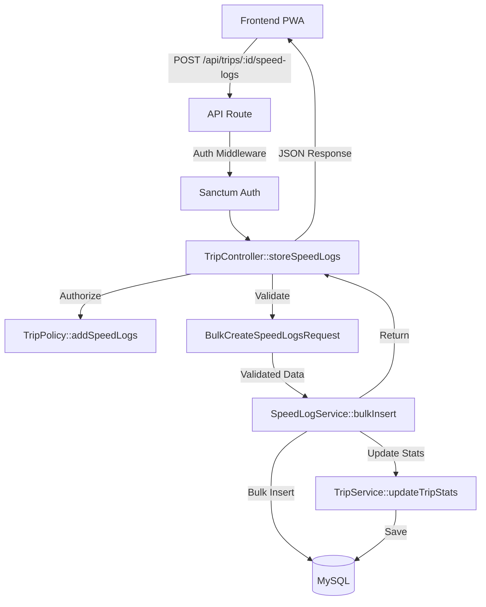

# Speed Log Bulk Insert API Implementation

## Context

User Story US-2.4 requires implementing an API endpoint that accepts an array of speed log objects and bulk inserts them to the database. This is critical for offline functionality where employees record speed logs locally (in IndexedDB) and need to sync them when connectivity is restored.

**Good News:** The core service layer logic (`SpeedLogService::bulkInsert`) is already implemented and tested. We only need to create the HTTP layer (controller method, form request, route, authorization).

## Architecture Overview



## Files to Create

### 1. Form Request Validation
**File:** [`app/Http/Requests/Trip/BulkCreateSpeedLogsRequest.php`](app/Http/Requests/Trip/BulkCreateSpeedLogsRequest.php)

Validates the incoming request:
- `speed_logs` array is required, must be array, not empty
- Each entry validates: `speed` (required, numeric, ≥0) and `recorded_at` (required, valid datetime)
- Reasonable max array size (e.g., 1000 entries) to prevent memory issues
- Custom validation messages for clear error feedback

Reference existing validation patterns from [`app/Http/Requests/Trip/StartTripRequest.php`](app/Http/Requests/Trip/StartTripRequest.php).

### 2. Controller Method
**File:** [`app/Http/Controllers/TripController.php`](app/Http/Controllers/TripController.php)

Add new `storeSpeedLogs()` method:
- Method signature: `storeSpeedLogs(BulkCreateSpeedLogsRequest $request, Trip $trip): JsonResponse`
- Authorize using `$this->authorize('addSpeedLogs', $trip)` policy gate
- Validate trip is in progress (only active trips accept speed logs)
- Call `SpeedLogService::bulkInsert()` with validated data
- Return success response with created count and summary
- Handle exceptions (service throws `InvalidArgumentException` on invalid data)
- Update `synced_at` timestamp on trip when logs are from offline sync

Follow existing controller patterns from methods like `store()` and `update()`.

### 3. Policy Authorization
**File:** [`app/Policies/TripPolicy.php`](app/Policies/TripPolicy.php)

Add `addSpeedLogs(User $user, Trip $trip): bool` method:
- Only trip owner can add speed logs to their own trip
- Supervisors/admins CANNOT add logs to other users' trips (maintains data integrity)
- Consistent with `update()` policy logic (only owner modifies their trip)

### 4. API Route
**File:** [`routes/api.php`](routes/api.php)

Add within `auth:sanctum` middleware group:
```php
Route::post('/trips/{trip}/speed-logs', [TripController::class, 'storeSpeedLogs'])
    ->name('trips.speed-logs.store');
```

Position it after existing trip routes for logical grouping.

## Files to Modify

### 5. Feature Tests
**File:** [`tests/Feature/Trips/TripControllerTest.php`](tests/Feature/Trips/TripControllerTest.php)

Add comprehensive test suite for new endpoint (following existing test patterns):

**Happy Path Tests:**
- ✓ Employee can bulk insert speed logs to own active trip
- ✓ Successfully creates multiple speed logs in database
- ✓ Returns correct response structure with created count
- ✓ Updates trip statistics after insert (max_speed, avg_speed, etc.)
- ✓ Calculates violation flags correctly based on speed limit
- ✓ Handles large batch (100+ logs) efficiently
- ✓ Updates trip `synced_at` timestamp for offline sync tracking

**Authorization Tests:**
- ✗ Employee cannot add logs to another user's trip (403)
- ✗ Supervisor cannot add logs to employee's trip (403)
- ✗ Unauthenticated user cannot add logs (401)

**Validation Tests:**
- ✗ Rejects empty speed_logs array (422)
- ✗ Rejects missing speed field (422)
- ✗ Rejects missing recorded_at field (422)
- ✗ Rejects negative speed values (422)
- ✗ Rejects non-numeric speed values (422)
- ✗ Rejects invalid datetime format (422)
- ✗ Rejects array exceeding max size (422)

**Business Logic Tests:**
- ✗ Cannot add logs to completed trip (422)
- ✗ Cannot add logs to auto-stopped trip (422)
- ✗ Returns proper error when trip not found (404)

Reference existing test patterns like `test_employee_can_start_trip()` and `test_ending_trip_calculates_statistics()`.

## API Specification

**Endpoint:** `POST /api/trips/{id}/speed-logs`

**Request Headers:**
```
Authorization: Bearer {sanctum_token}
Content-Type: application/json
```

**Request Body:**
```json
{
  "speed_logs": [
    {
      "speed": 45.5,
      "recorded_at": "2026-03-30 10:00:00"
    },
    {
      "speed": 62.0,
      "recorded_at": "2026-03-30 10:00:05"
    },
    {
      "speed": 58.3,
      "recorded_at": "2026-03-30 10:00:10"
    }
  ]
}
```

**Success Response (200):**
```json
{
  "message": "Speed logs created successfully",
  "created_count": 3,
  "trip": {
    "id": 1,
    "max_speed": 62.0,
    "average_speed": 55.27,
    "total_distance": 0.23,
    "violation_count": 1,
    "synced_at": "2026-03-30 10:15:00"
  }
}
```

**Error Response (422):**
```json
{
  "message": "Validation failed",
  "errors": {
    "speed_logs.0.speed": ["The speed field is required"],
    "speed_logs.2.recorded_at": ["Invalid datetime format"]
  }
}
```

## Implementation Steps

1. **Create Form Request** - Define validation rules for bulk speed log data
2. **Add Policy Method** - Implement `addSpeedLogs()` authorization logic
3. **Add Controller Method** - Implement `storeSpeedLogs()` with authorization, validation, and service call
4. **Add Route** - Register new endpoint in `routes/api.php`
5. **Write Feature Tests** - Comprehensive test coverage for all scenarios
6. **Run Tests** - Execute new tests to verify implementation: `php artisan test --filter=storeSpeedLogs`
7. **Manual API Testing** - Test with Postman/curl using sample data
8. **Run Laravel Pint** - Format code: `vendor/bin/pint --dirty --format agent`
9. **Run Full Test Suite** - Ensure no regressions: `php artisan test --compact`

## Key Considerations

### Performance
- Service layer already uses efficient bulk insert (`DB::table()->insert()`)
- Validated speed log service tests show it handles 100+ records efficiently
- Consider adding database transaction if not already present in service

### Offline Sync Support
- Frontend will batch speed logs recorded offline in IndexedDB
- When device reconnects, call this endpoint with batched data
- `synced_at` timestamp helps track which trips have been synchronized
- Trip statistics automatically recalculated after insert

### Data Integrity
- Only trip owner can add speed logs (prevents data tampering)
- Trip must be in InProgress status to accept logs
- Service layer validates all speed values (non-negative, numeric)
- Violation flags calculated using current speed limit setting

### Error Handling
- Validation errors return 422 with specific field errors
- Service throws `InvalidArgumentException` on data issues
- Controller catches exceptions and returns appropriate error responses
- Failed sync attempts can be retried by client

## Testing Strategy

### Unit Tests
Already exist in [`tests/Unit/Services/SpeedLogServiceTest.php`](tests/Unit/Services/SpeedLogServiceTest.php) - comprehensive coverage of service layer logic including:
- Bulk insert with multiple logs
- Violation flag calculation
- Trip statistics update
- Validation error handling
- Large dataset handling

### Feature Tests
New tests to add in [`tests/Feature/Trips/TripControllerTest.php`](tests/Feature/Trips/TripControllerTest.php):
- HTTP endpoint authorization
- Request validation
- Success response structure
- Error response handling
- Integration with service layer

### Manual Testing
Test realistic offline sync scenario:
1. Create active trip via `POST /api/trips`
2. Simulate offline: batch 10-20 speed logs with 5-second intervals
3. Call bulk insert endpoint with batched data
4. Verify trip statistics updated correctly
5. Check violation flags match speed limit setting
6. Confirm `synced_at` timestamp updated

## Success Criteria

- [x] Endpoint accepts array of speed log objects
- [x] Validates each log entry (speed, recorded_at)
- [x] Bulk inserts to database efficiently
- [x] Updates trip statistics after insert
- [x] Returns success/failure summary
- [x] Only trip owner can add logs to their trip
- [x] Trip must be in InProgress status
- [x] All tests passing (unit + feature)
- [x] Code formatted with Laravel Pint
- [x] Comprehensive PHPDoc documentation

## Acceptance Criteria from US-2.4

✓ `POST /api/trips/{id}/speed-logs` endpoint created  
✓ Accepts array of speed log objects  
✓ Validates each log entry  
✓ Bulk inserts to database  
✓ Updates trip statistics after insert  
✓ Returns success/failure summary
