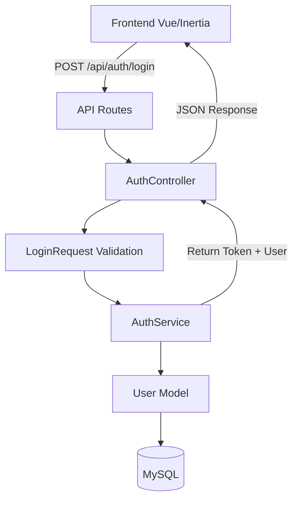

# US-1.4: Implement User Authentication (Backend)

## Current State

Based on the codebase analysis:
- ✅ Database migrations complete (US-1.3) - users table has `role` and `is_active` fields
- ✅ Pinia stores created on frontend (US-1.2)
- ❌ Laravel Sanctum NOT installed
- ❌ No API routes configured
- ❌ No authentication controllers, services, or form requests exist
- ❌ User model needs updates for role/is_active fields

## Architecture Overview

This implementation follows the service pattern defined in [AGENTS.md](AGENTS.md):



## Implementation Steps

### 1. Install and Configure Laravel Sanctum

**Install package:**
```bash
composer require laravel/sanctum
```

**Publish configuration:**
```bash
php artisan vendor:publish --provider="Laravel\Sanctum\SanctumServiceProvider"
```

**Run migrations:**
```bash
php artisan migrate
```

**Configure Sanctum for SPA authentication:**
- Update [`config/sanctum.php`](config/sanctum.php) - set stateful domains for API
- Configure CORS in [`config/cors.php`](config/cors.php) if needed
- Add Sanctum middleware to API routes

### 2. Update User Model

File: [`app/Models/User.php`](app/Models/User.php)

**Changes needed:**
- Add `role` and `is_active` to fillable array (or update Fillable attribute)
- Add `role` and `is_active` to casts array
- Ensure model uses `HasApiTokens` trait from Sanctum
- Add helper methods: `isEmployee()`, `isSupervisor()`, `isAdmin()`

```php
use Laravel\Sanctum\HasApiTokens;

protected function casts(): array
{
    return [
        'email_verified_at' => 'datetime',
        'password' => 'hashed',
        'is_active' => 'boolean',
        'role' => 'string',
    ];
}
```

### 3. Update User Factory

File: [`database/factories/UserFactory.php`](database/factories/UserFactory.php)

**Add to definition():**
- `'role' => 'employee'` (default)
- `'is_active' => true`

**Add factory states:**
- `admin()` - creates admin user
- `supervisor()` - creates supervisor user
- `employee()` - creates employee user (default)
- `inactive()` - creates inactive user

### 4. Create AuthService

File: `app/Services/AuthService.php`

Following Laravel service pattern, implement:

**Methods:**
- `login(array $credentials): array` - Authenticates user and returns token + user data
  - Validate credentials using Auth::attempt()
  - Check if user is_active
  - Create Sanctum token
  - Return `['token' => $token, 'user' => $user]`
  
- `logout(User $user): void` - Revokes current access token
  - Delete current token: `$user->currentAccessToken()->delete()`
  
- `getCurrentUser(User $user): User` - Returns authenticated user with role
  - Simply return the user (can add eager loading if needed)

**Error handling:**
- Throw `AuthenticationException` for invalid credentials
- Throw custom exception for inactive users

### 5. Create LoginRequest

File: `app/Http/Requests/Auth/LoginRequest.php`

Use Artisan command:
```bash
php artisan make:request Auth/LoginRequest
```

**Validation rules:**
```php
public function rules(): array
{
    return [
        'email' => ['required', 'email', 'string', 'max:255'],
        'password' => ['required', 'string', 'min:8'],
    ];
}
```

**Custom messages:**
- Indonesian language support per user rules (timezone: Asia/Jakarta)

### 6. Create AuthController

File: `app/Http/Controllers/Auth/AuthController.php`

Use Artisan command:
```bash
php artisan make:controller Auth/AuthController
```

**Constructor injection:**
```php
public function __construct(private AuthService $authService) {}
```

**Methods:**

**POST `/api/auth/login`** - `login(LoginRequest $request)`
- Call `$this->authService->login($request->validated())`
- Return JSON: `{ token, user: { id, name, email, role, is_active } }`
- Status: 200 OK
- Errors: 401 Unauthorized (invalid credentials), 403 Forbidden (inactive)

**POST `/api/auth/logout`** - `logout(Request $request)`
- Call `$this->authService->logout($request->user())`
- Return JSON: `{ message: 'Logged out successfully' }`
- Status: 200 OK
- Requires: `auth:sanctum` middleware

**GET `/api/auth/me`** - `me(Request $request)`
- Call `$this->authService->getCurrentUser($request->user())`
- Return JSON: `{ user: { id, name, email, role, is_active } }`
- Status: 200 OK
- Requires: `auth:sanctum` middleware

### 7. Create API Routes

File: `routes/api.php` (create new file)

**Register in bootstrap/app.php:**
Update [`bootstrap/app.php`](bootstrap/app.php) `withRouting()` method:
```php
->withRouting(
    web: __DIR__.'/../routes/web.php',
    api: __DIR__.'/../routes/api.php',
    commands: __DIR__.'/../routes/console.php',
    health: '/up',
)
```

**Routes to create in api.php:**
```php
use App\Http\Controllers\Auth\AuthController;

// Public routes
Route::post('/auth/login', [AuthController::class, 'login'])->name('auth.login');

// Protected routes (require Sanctum authentication)
Route::middleware('auth:sanctum')->group(function () {
    Route::post('/auth/logout', [AuthController::class, 'logout'])->name('auth.logout');
    Route::get('/auth/me', [AuthController::class, 'me'])->name('auth.me');
});
```

**API prefix:** All routes automatically prefixed with `/api`

### 8. Update Database Seeder

File: [`database/seeders/DatabaseSeeder.php`](database/seeders/DatabaseSeeder.php)

Create test users for development:
- Admin user: `admin@example.com` / `password` (role: admin)
- Supervisor user: `supervisor@example.com` / `password` (role: supervisor)
- Employee user: `employee@example.com` / `password` (role: employee)

### 9. Configure Middleware and CORS

**CORS Configuration:**
- Update [`config/cors.php`](config/cors.php) to allow frontend domain
- Set `supports_credentials => true` for Sanctum cookies

**Sanctum Configuration:**
- Update [`config/sanctum.php`](config/sanctum.php)
- Add stateful domains (localhost for development)

### 10. Create Feature Tests

File: `tests/Feature/Auth/AuthenticationTest.php`

**Test cases:**
- ✅ User can login with valid credentials
- ✅ User receives token and user data on login
- ✅ User cannot login with invalid email
- ✅ User cannot login with invalid password
- ✅ User cannot login if account is inactive
- ✅ User can logout successfully
- ✅ User can access /auth/me with valid token
- ✅ User cannot access /auth/me without token
- ✅ Token is revoked after logout
- ✅ Login returns correct user role

**Use PHPUnit** (not Pest) as specified in [AGENTS.md](AGENTS.md)

### 11. Code Formatting

Run Laravel Pint as required:
```bash
vendor/bin/pint --dirty --format agent
```

## Files to Create

### New Files
1. `app/Services/AuthService.php` - Authentication business logic
2. `app/Http/Controllers/Auth/AuthController.php` - API endpoints
3. `app/Http/Requests/Auth/LoginRequest.php` - Login validation
4. `routes/api.php` - API route definitions
5. `tests/Feature/Auth/AuthenticationTest.php` - Feature tests

### Files to Modify
1. [`app/Models/User.php`](app/Models/User.php) - Add Sanctum traits and role methods
2. [`database/factories/UserFactory.php`](database/factories/UserFactory.php) - Add role/is_active states
3. [`database/seeders/DatabaseSeeder.php`](database/seeders/DatabaseSeeder.php) - Create test users
4. [`bootstrap/app.php`](bootstrap/app.php) - Register API routes
5. [`config/sanctum.php`](config/sanctum.php) - Configure stateful domains (after publish)
6. [`config/cors.php`](config/cors.php) - Configure CORS if needed

## Verification Checklist

### API Endpoint Testing (Manual with Postman/Insomnia)

**Login Endpoint:**
```bash
POST http://localhost:8000/api/auth/login
Content-Type: application/json

{
  "email": "admin@example.com",
  "password": "password"
}

Expected Response (200):
{
  "token": "1|abc123...",
  "user": {
    "id": 1,
    "name": "Admin User",
    "email": "admin@example.com",
    "role": "admin",
    "is_active": true
  }
}
```

**Get Current User:**
```bash
GET http://localhost:8000/api/auth/me
Authorization: Bearer {token}

Expected Response (200):
{
  "user": {
    "id": 1,
    "name": "Admin User",
    "email": "admin@example.com",
    "role": "admin",
    "is_active": true
  }
}
```

**Logout:**
```bash
POST http://localhost:8000/api/auth/logout
Authorization: Bearer {token}

Expected Response (200):
{
  "message": "Logged out successfully"
}
```

### Automated Tests
```bash
php artisan test --filter=AuthenticationTest
```

All tests should pass (10/10).

### Code Quality
```bash
vendor/bin/pint --dirty --format agent
```

Should show "No changes needed" after formatting.

## Technical Notes

### Token Management
- **Token Type:** Sanctum API tokens (not SPA session-based)
- **Token Storage:** Frontend should store in localStorage
- **Token Lifetime:** Default (no expiration unless revoked)
- **Token Format:** `{tokenId}|{plainTextToken}`

### Security Considerations
- Passwords hashed with bcrypt (Laravel default)
- Rate limiting applied to login endpoint (60 requests/minute)
- HTTPS only in production
- Inactive users cannot login (403 response)

### Service Pattern Benefits
- Business logic separated from controllers
- Easier to test (mock AuthService in tests)
- Reusable across different contexts (API, CLI)
- Follows Laravel best practices per [AGENTS.md](AGENTS.md)

## Dependencies

**Completion Order:**
1. Install Sanctum package → 2. Publish config → 3. Update User model → 4. Create service → 5. Create controller → 6. Create routes → 7. Create tests

**Blocked By:** None (US-1.2 and US-1.3 completed)

**Blocks:** US-1.5 (Frontend Login Page needs these API endpoints)

## Success Criteria

All acceptance criteria from [docs/SCRUM_WORKFLOW.md](docs/SCRUM_WORKFLOW.md) US-1.4:
- ✅ Laravel Sanctum configured
- ✅ Login API endpoint created (`POST /api/auth/login`)
- ✅ Logout API endpoint created (`POST /api/auth/logout`)
- ✅ Get current user endpoint (`GET /api/auth/me`)
- ✅ Form request validation for login
- ✅ AuthService created (service pattern)
- ✅ Returns proper JWT token (Sanctum token)
- ✅ Returns user with role
- ✅ All tests passing
- ✅ Code formatted with Pint
