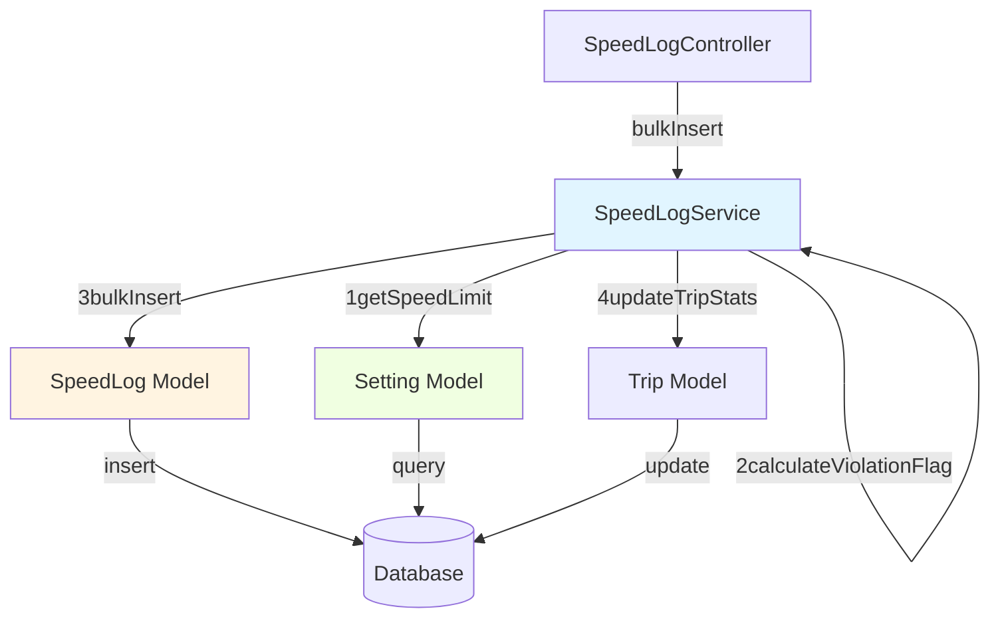

# Plan: US-2.2 - Create Speed Log Model Enhancement

## Current State Analysis

The SpeedLog model already exists with basic functionality:
- Model: [`app/Models/SpeedLog.php`](app/Models/SpeedLog.php) ✅
- Migration: [`database/migrations/2026_03_30_161637_create_speed_logs_table.php`](database/migrations/2026_03_30_161637_create_speed_logs_table.php) ✅
- Factory: [`database/factories/SpeedLogFactory.php`](database/factories/SpeedLogFactory.php) ✅
- Relationship: `belongsTo(Trip::class)` ✅
- Tests: Covered in [`tests/Feature/Models/TripTest.php`](tests/Feature/Models/TripTest.php) ✅

## Gap Analysis

Based on US-2.2 acceptance criteria, we need to add:

1. **Bulk Insert Method** ❌ (Missing - Critical requirement)
2. **Dynamic `is_violation` Calculation** ⚠️ (Partially implemented - hardcoded in factory)
3. **SpeedLogService** ❌ (Missing - for business logic following service pattern)
4. **Comprehensive Unit Tests** ⚠️ (Only feature tests exist)

## Implementation Strategy

### 1. Create SpeedLogService

Following the existing service pattern (see [`app/Services/TripService.php`](app/Services/TripService.php)), create a dedicated service for speed log operations:

**File:** `app/Services/SpeedLogService.php`

**Methods:**
- `bulkInsert(Trip $trip, array $speedLogData): Collection` - Main requirement
- `calculateViolationFlag(float $speed, float $speedLimit): bool` - Helper for violation detection
- `getSpeedLimit(): float` - Retrieve from settings (or default to 60 km/h until US-2.5 is done)

**Bulk Insert Logic:**
- Accept array of speed log records: `[{speed, recorded_at}, ...]`
- Validate each entry
- Calculate `is_violation` for each based on speed_limit setting
- Use Eloquent `insert()` for bulk efficiency
- Update trip statistics after insert
- Return created records

### 2. Enhance SpeedLog Model

**Add to [`app/Models/SpeedLog.php`](app/Models/SpeedLog.php):**

- Static method `bulkCreate()` as facade to service
- Scope `violations()` - for querying violation records
- Scope `safe()` - for querying safe speed records
- Accessor `getSpeedLimitAttribute()` - retrieve current speed limit

### 3. Update Settings Infrastructure

**Create:** `app/Models/Setting.php`

Basic key-value model for app settings (needed for US-2.2 but will be fully implemented in US-2.5):
- Methods: `get(string $key, mixed $default)`, `set(string $key, mixed $value)`
- Default speed_limit: 60 km/h

### 4. Create Comprehensive Tests

**Create:** `tests/Unit/Services/SpeedLogServiceTest.php`

Test coverage:
- `test_bulk_insert_creates_multiple_speed_logs()`
- `test_bulk_insert_calculates_violation_flags()`
- `test_bulk_insert_updates_trip_statistics()`
- `test_bulk_insert_validates_input_data()`
- `test_bulk_insert_handles_empty_array()`
- `test_calculate_violation_flag_returns_true_when_speed_exceeds_limit()`
- `test_calculate_violation_flag_returns_false_when_speed_within_limit()`
- `test_get_speed_limit_returns_default_when_setting_not_exists()`

**Create:** `tests/Feature/Models/SpeedLogTest.php`

Dedicated feature tests for SpeedLog (currently tested only via TripTest):
- Model relationships
- Factory states
- Mass assignment
- Casts verification
- Query scopes

### 5. Database Seeder (Optional for Testing)

**Update:** `database/seeders/DatabaseSeeder.php`

Add settings seeder for speed_limit (will be part of US-2.5, but can add default now):

```php
DB::table('settings')->insert([
    'key' => 'speed_limit',
    'value' => '60',
    'description' => 'Global speed limit in km/h',
]);
```

## Implementation Order

1. **Create Setting Model** - Basic infrastructure for speed limit retrieval
2. **Create SpeedLogService** - Core business logic with bulk insert
3. **Enhance SpeedLog Model** - Add convenience methods and scopes
4. **Create Unit Tests** - Test service layer thoroughly
5. **Create Feature Tests** - Dedicated SpeedLog model tests
6. **Run Laravel Pint** - Format all PHP files
7. **Execute Tests** - Verify all tests pass

## Architecture Diagram



## Files to Create/Modify

### Create New Files:
1. `app/Services/SpeedLogService.php` (New service layer)
2. `app/Models/Setting.php` (Settings model)
3. `tests/Unit/Services/SpeedLogServiceTest.php` (Service tests)
4. `tests/Feature/Models/SpeedLogTest.php` (Model feature tests)

### Modify Existing Files:
1. [`app/Models/SpeedLog.php`](app/Models/SpeedLog.php) - Add query scopes and helpers
2. [`database/seeders/DatabaseSeeder.php`](database/seeders/DatabaseSeeder.php) - Add default settings

### Files to Review:
- [`app/Services/TripService.php`](app/Services/TripService.php) - Pattern reference
- [`app/Models/Trip.php`](app/Models/Trip.php) - Relationship reference
- [`tests/Unit/Services/TripServiceTest.php`](tests/Unit/Services/TripServiceTest.php) - Test pattern reference

## Key Technical Decisions

### Bulk Insert Approach

Use Eloquent's `insert()` method for performance:
- Pros: Single query, fast for large datasets
- Cons: Doesn't trigger model events, no auto timestamps
- Solution: Manually set `created_at` timestamp in service

### Violation Calculation Strategy

Calculate during insert, not on-the-fly:
- Store `is_violation` in database (already in schema)
- Avoids repeated calculations on read
- Trade-off: If speed limit changes, old records remain unchanged (acceptable per requirements)

### Service Layer Pattern

Follow existing TripService pattern:
- Service handles business logic
- Controller handles HTTP concerns (will be in US-2.3)
- Model handles data access
- Clear separation of concerns

## Testing Strategy

### Unit Tests (Service Layer)
- Mock Setting model for speed limit
- Test bulk insert with various data sets
- Test edge cases (empty array, invalid data)
- Test violation calculation logic

### Feature Tests (Model Layer)
- Test database interactions
- Test relationships work correctly
- Test factory states
- Test query scopes

### Integration Tests (Future US-2.4)
- API endpoint testing
- Full offline sync workflow
- End-to-end trip with speed logs

## Definition of Done

- [ ] SpeedLogService created with bulkInsert method
- [ ] Dynamic is_violation calculation based on settings
- [ ] Setting model created for configuration
- [ ] All unit tests pass (aim for 100% service coverage)
- [ ] All feature tests pass
- [ ] Code formatted with Laravel Pint
- [ ] No linter errors
- [ ] Follows Laravel best practices
- [ ] Documentation added to all methods
- [ ] Tested manually with tinker

## Success Criteria Validation

US-2.2 Acceptance Criteria:
- [✅] SpeedLog model created (already exists)
- [✅] Belongs to Trip relationship (already exists)
- [✅] is_violation flag calculated based on speed_limit (will be dynamic)
- [✅] Bulk insert method for efficiency (new SpeedLogService)

## Notes

- Settings infrastructure will be fully implemented in US-2.5, but we need basic Model now
- The bulk insert API endpoint will be created in US-2.4
- This story focuses on model/service layer only (backend business logic)
- Frontend integration comes in Sprint 3+
